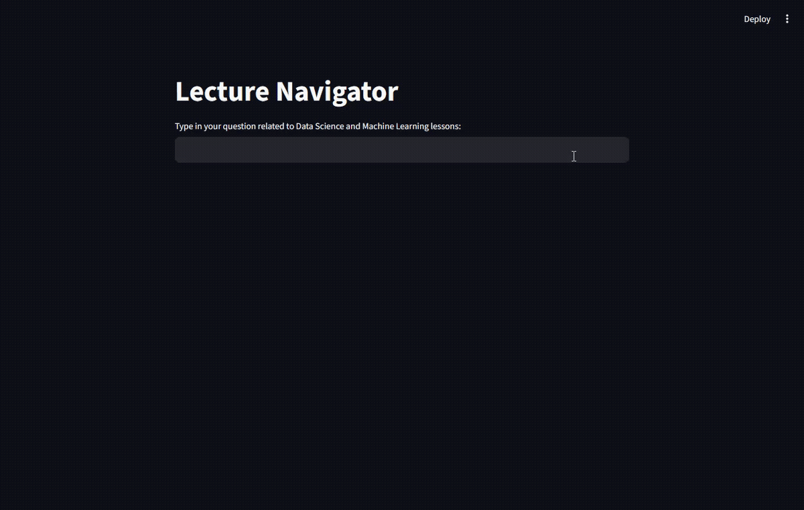

# Lecture Navigator


## Overview
### A Smart AI Assistant for Finding Lecture Slide Content
 
Lecture Navigator is an AI-powered assistant designed to help students in TKH to quickly find materials that was discussed across a large collection of Data Science & Machine Learning lecture slides. By asking questions like "Where did we talk about Euclidean distance?", users receive precise slide references and page numbers—saving time and improving reviewing process.
 
This tool leverages OpenAI's Assistants API, a vector database, and retrieval-augmented generation (RAG) to enable context-aware search grounded in actual slide content. The tool has been built with hallucination control in mind and aims for citation-level precision.

```
Table of Contents:
· Overview
· Team Members
· Features
· Setup Instructions
· System Architecture
· Core Files
· Example Use Cases
```
```
Team Members:
· Vanessa Chu,
· Kahdijah Lemaine,
· James Ceus,
· Talgat Medetov,
· Jessica Benavente
```
```
Features
· Accepts natural language queries from students
· Searches slide content using vector embeddings
· Returns only slide filenames, page numbers, and concise explanations
· Easy-to-adapt prompt structure for new subjects
```
## Setup Instructions
 
How to Run
 
To run this application locally:
1. Clone the Repo
2. Install Dependencies

- Run:
`pip install python-dotenv faiss-cpu sentence-transformers openai`
 
3. Prepare the Environment
Create a .env file in the project root:
```
API_KEY=your_openai_api_key
PROJECT_ID=your_openai_project_id
VEC_ID=your_vector_store_id
```

4. Upload Lecture Slides
All course PDFs should be placed in the data/ directory
```
## This script loops through and uploads each PDF into the vector DB
from your_module import upload_pdf
 
for file in os.listdir('data/'):
    if file.endswith(".pdf"):
        upload_pdf(f"data/{file}")
```
5. Ask a Question
```
print(ask("What is the difference between KNN and K-means?"))
```

```
System Architecture
+-------------+           +------------------+           +-------------------------+
| User Input  |  --->     | OpenAI Assistant |   --->    | Vector DB Search (RAG)  |
+-------------+           +------------------+           +-------------------------+
                                                |
                                    Returns matched pages + explanations
                                                ↓
                                        Formatted response
```

Embeddings: Slides are converted to vector form using sentence-transformers.
Vector DB: FAISS (CPU) stores vectors for fast semantic search.
RAG: OpenAI’s Assistants API uses search hits to generate accurate responses.
System Prompt: Custom prompt ensures only grounded, citation-formatted answers.
 
### Core Files
```
File           Purpose
main.py        Runs the app logic using OpenAI Assistant and vector search
upload_pdf()   Uploads PDFs and indexes them in the vector store
ask(prompt)    Sends a user question and returns grounded answer
.env           Stores secrets like API keys and project ID
data/          Folder with all PDF slides
```
 
### Example Use Cases
Example 1:

Input:
"Which lecture slides mentioned Euclidean Distance?"

Output:
+ Slides: Introduction to K-Nearest-Neighbors.pdf  
  Pages: 7, 12, 17  
  Explanation: Details the calculation of Euclidean distance in kNN...
 
+ Slides: Introduction to Unsupervised Learning Algorithms.pdf 
  Pages: 1, 2, 4, 9  
  Explanation: Discusses the use of squared Euclidean distance...

Example 2:

Input:
"What is the difference between supervised and unsupervised learning?"

Output:
+ Slides: Introduction to Decision Trees.pdf  
  Pages: 8, 10-12  
  Explanation: Describes decision trees as supervised learning models...
 
+ Slides: Introduction to Unsupervised Learning Algorithms.pdf 
  Pages: 1-3  
  Explanation: Explains clustering and how it contrasts with labeled training...
 
### Final Notes
Lecture Navigator is a practical example of how Retrieval-Augmented Generation can enhance the student learning experience by:
- Reducing time spent reviewing
- Improving content understanding
- Delivering real-time, grounded AI assistance
Built by TKH Fellows. Powered by OpenAI. Designed for learners.


## Contributions
- Vanessa : Prompt Engineering, Github Formatting & Streamlit
- James: Led Team direction, StandUp #1, Readme Contributor
- Jessica: Readme
- Talgat: Readme
- Kahdijah: Test Prompts, Google slides & Final Standup
